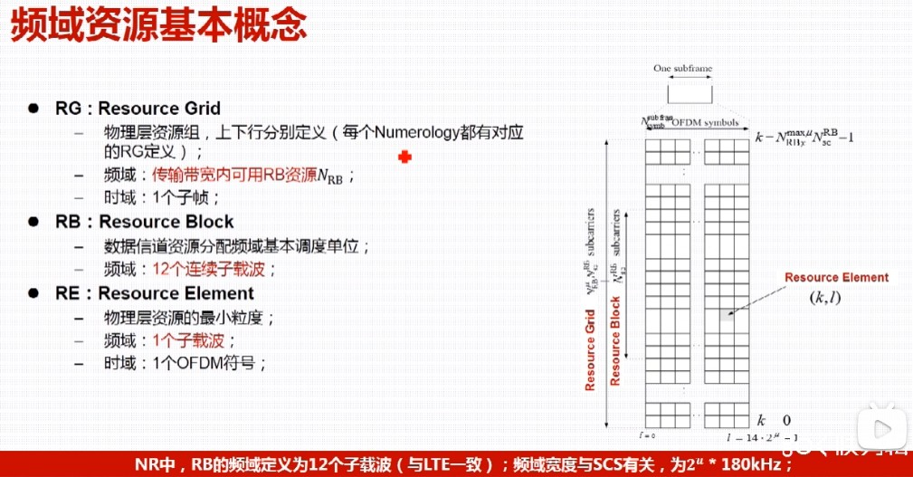

5G NR学习笔记

在5G NR（New Radio）通信中，空口资源是指无线通信系统中用于数据传输和控制信息交互的无线资源。这些资源主要包括时域资源、频域资源和空域资源。

[toc]

# 一、时域资源
在5G NR技术中，无线信号的传输在时间域上被组织为帧（Frame）、子帧（Subframe）和时隙（Slot）、符号（OFDM Symbol）四级结构。

## 1. 时域资源帧结构、基本概念
### 1.1 帧（Frame）
- **时长**：1个无线帧的时长为10ms。
- **作用**：是时域资源的最高层级单位，用于组织和管理整个无线通信的时间资源。
帧在系统中的标识（系统编号，SFN）占10bit，共1024个，0, 1, 2, ..., 1023。

### 1.2 子帧（Subframe）
- **时长**：1个无线帧包含**10**个子帧，每个子帧的时长为1ms。
- **作用**：子帧是帧的细分单位，用于进一步划分时间资源，方便更灵活地调度和分配。

### 1.3 时隙（Slot）
- **时长**：时隙的时长、每个帧/子帧所包含时隙数量的取决于**子载波间隔（SCS）**，具体如下：

- **作用**：**时隙是数据调度的基本单位**，基站根据业务需求灵活分配时隙资源。

### 1.4 符号（OFDM 符号，OFDM Symbol）
- **数量**：每个时隙包含**14个**OFDM符号。
- **作用**：OFDM符号是**调制的基本单位**，是时域资源的最小单位，用于承载数据和控制信息。
时隙和符号的时长和子载波间隔有关，即：$ T = 1 / f$ 。

### 1.5 符号的时间长度
- 符号的时间长度由SCS决定，包括 CP 和 data 两部分 $ t_{sym} = t_{data} + t_{cp}$。

- 数据data部分，OFDM 符号长度 $ t_{data} = \frac{1}{SCS} $，时隙长度为 $ t_{slot} = \frac{1}{2^\miu} $。
- CP部分， $ t_{cp} = \frac{144}{2048} t_{data} $ 。

### 1.6 采样点
- **作用**：物理层的基本时间单位。

### 1.7 slot 格式与类型
数据的调度以slot为单位进行调度，5G也可以以符号为单位调度（对时延要求较高的场景，如URLCC），主要以时隙为单位（eMBB等场景）。

- slot 基本构成
  - Downlink，下行传输，表示为D
  - Uplink，上行传输，表示为U
  - Flexible，可用于上行传输、下行传输、GP或作为预留资源，表示为F

- slot 的主要类型：
  - Case 1：全下行时隙，DL-only Slot，整个时隙仅用于下行数据传输，适用于下行数据量较大且需要集中传输的场景，例如高清视频流媒体服务。
  - Case 2：全上行时隙，UL-only Slot，整个时隙仅用于上行数据传输，适用于上行数据量较大且需要集中传输的场景，例如物联网设备的大规模数据上传。
  - Case 3：灵活时隙，Flexible-only Slot，时隙的资源分配可以根据需要动态调整，既可以分配为下行资源，也可以分配为上行资源，甚至可以同时包含下行和上行资源。适用于需要灵活调度的场景，例如在不同的业务负载下动态调整上下行资源分配比例。
  - Case 4：混合时隙，Mixed Slot，时隙中至少有1个下行和上行。下行资源用于传输下行数据和控制信息，上行资源用于传输上行数据和反馈信息。适用于需要同时支持上下行传输的场景，例如实时交互应用（如视频通话）。

注：
- case 4-1~5，只使用了4-3大部分用于下行，中间有一部分未使用，用于GP，保护间隔，中国移动使用 6：4：4比例分配
- 4-5 14个符号定义了上行、下行GP等，是自包含时隙
- 双工：TDD时分双工和FDD频分双工。时分双工，收发都在一个子载波上，以时间区分哪些slot发、哪些slot收

### 1.8 特殊结构
- **自包含时隙（Self-Contained Slot）** 
自包含时隙是5G NR中一种特殊的时隙结构，其核心特点是将调度信息、数据传输以及对应的反馈信息全部包含在一个时隙内，从而显著降低往返时延（RTT），提升系统的时延性能。3GPP未明确定义。

自包含时隙主要分为两种类型：

  - 下行自包含时隙：包含**DL数据和相应HARQ反馈**。在同一时隙内，基站通过PDCCH（下行控制信道）调度PDSCH（下行共享信道）的数据传输，并在同一时隙内通过PUCCH（上行控制信道）接收终端的HARQ-ACK（混合自动重传请求确认）反馈。
  - 上行自包含时隙：包含**UL调度信息和UL数据**。在同一时隙内，基站通过PDCCH调度PUSCH（上行共享信道）的上行数据传输，且上行数据和调度信息均在同一时隙内完成。
  - 设计目标：通过更快的下行HARQ反馈和上行UL调度，降低RTT时延，或实现更小的SRS发送周期。

- **Mini-slot（微时隙）**：支持在一个时隙内用户间的时分复用，可抢占正在进行的、面向其他设备的较长传输，从而立即发送需要超低时延的数据。

### 1.9 UL/DL 时隙/帧配比
四层嵌套方式进行配置。

## 2. 时域资源分配（PDSCH相关）
- **信令设计**：时域资源分配的决策由无线资源控制（RRC）信令配置和下行控制信息（DCI）协同完成。例如，DCI中包含Timedomainresourceassignment域，用于指示具体的时域资源分配表。
- **映射类型**：包括Type A和Type B两种，可根据不同的业务需求和场景进行灵活选择。

## 3. 循环前缀（cyclic prefix，CP）

时域资源的帧结构和时隙配比的意义：基站告诉UE在那个帧/时隙/符号进行发送和接收数据，即实现基站和UE在时间上的同步。同步包括上行同步、下行同步，帧/时隙/符号同步。

# 二、频域资源

## 1. 频域资源基本概念
### 1.1 资源粒子
- 资源粒子是物理层资源的最小粒度，由频域上的一个子载波和时域上的一个OFDM符号组成。是资源栅格中的最小单元，
- 一个只能传一个调制符号/OFDM符号，
  - 调制符号：4G 使用64 QAM 调制，5G 使用256QAM调制，分别表示 6bit 和 8bit 信息
  - 一个资源粒子的信息量（bit）和调制方式相关，即通过调制提高空口速率

### 1.2 资源块
在5G NR（New Radio）通信中，**资源块（Resource Block，RB）**是频域资源分配的基本单位，用于描述频域资源的分配和管理。
- 数据信道资源分配中频域资源调度的基本单位
- 频域是12个连续的子载波
  - 4G：时间上1个时隙，频域上12个连续子载波
  - 5G：RB 是单纯的频域概念

### 1.3 资源栅格
给定的天线端口、子载波间隔配置μ和传输方向（上行或下行），资源栅格在时域上对应1个子帧（1ms），在频域上对应整个载波带宽
- 物理层资源组、上下行分别定义，每个Numerology 都有相应RG定义
- 频域上，包含BWP内所有可用的RB资源
- 时域上，一个子帧

## 2. 部分带宽（Bandwidth Part，BWP）

部分带宽（BWP）是5G NR中一种重要的频域资源管理机制，通过灵活的BWP配置和动态切换，5G NR能够更高效地利用频谱资源，支持多样化的业务需求和设备能力。
参考阅读 [带宽部分（BWP）|带你读《5G空口特性与关键技术》之十](https://developer.aliyun.com/article/745433)

### 2.1 BWP的应用场景/设计目的：
1. 可以使小带宽能力的UE接入大带宽网络
2. 根据需要来灵活调整UE收发带宽，在话务量低的时候可以达到省电效果
3. 可为UE配置不同Numerology，不同 BWP，以支持不同的业务类型

### 2.2 BWP的类型：
1. 初始BWP（Initial BWP）：UE在小区接入过程中使用的BWP。初始BWP通常包含系统信息和初始接入时的信道资源（NSA组网中由RRC信令下发、SA组网中由SIB1下发）。
2. 专用BWP（Dedicated BWP）：UE在RRC连接态配置时的BWP（由RRC信令动态配置）；
3. 激活BWP（Active BWP）：UE在RRC连接态时，某一时刻激活的BWP（即工作时的BWP），是 Dedicated BWP 中的一个，上/下行各一个；
4. 缺省BWP（Default BWP）：UE在RRC连接态时，当其 BWP inactivity timer超时后，回到默认BWP上，也是 Dedicated BWP 中的一个，由RRC信令指示UE 哪一个Dedicated BWP 是Default BWP，一般来说带宽更小（省电）。

**专用 BWP** 注意：
- 一个UE最多可以配置4个专用BWP的说明：
- BWP分为上行BWP和下行BWP，各四个，可以说有8个专用BWP
- 若UE支持SUL上下行解耦，则又有4个上行BWP，此时可以说有12个专用BWP

### 2.3 BWP的配置：
Dedicated BWP **的配置**
- 通过RRC信令配置给UE
  - FDD(paired spectrum)：最多可配置4个DL Dedicated BWP，UL Dedicated BWP
  - TDD(unpaired spectrum)：最多可配置4个DL/UL BWP pairs
  - SUL : 4个 UL Dedicated BWP
- BWP **粒度**：1 PRB，大小 ≤UE 支持的最大带宽（初始接入时上报）
- 每个Dedicated BWP可通过RRC信令配置以下属性，包括
  - Numerology (sub-carrier spacing, CP type)
  - Bandwidth (a group of contiguous PRBs)
  - Frequency location (starting position)
- UE在某一时刻只能激活1个配置给它的Dedicated BWP做为其当前时刻的Active BWP

UE Dedicated **PRB 位置**的确定
1. 小区内所有UE的Dedicated BWP的位置都基于一个相同的公共参考点Point A
2. 每个UE通过分配给自己的一个相对于Point A的Offset来确定自己的Dedicated BWP的起始位置（RRC信令获取）
3. UE知道起始位置，再结合分配的Dedicated BWP的带宽，获取结束位置
4. UE最终完成其Dedicated BWP的频域位置及大小

# 空域资源 / MIMO

空域资源是指在空间维度上分配的资源，主要主要是指多天线技术（如MIMO）和波束成形（Beamforming）。

## 1. MIMO 
### 1.1 基本概念

---

> 更多参见 [5G网优培训系列-NR帧结构&空口资源1](https://www.bilibili.com/video/BV1mf4y147Ma/?spm_id_from=333.788.videopod.sections&vd_source=bb9badd1987693a86aad2ffca45380ac)
